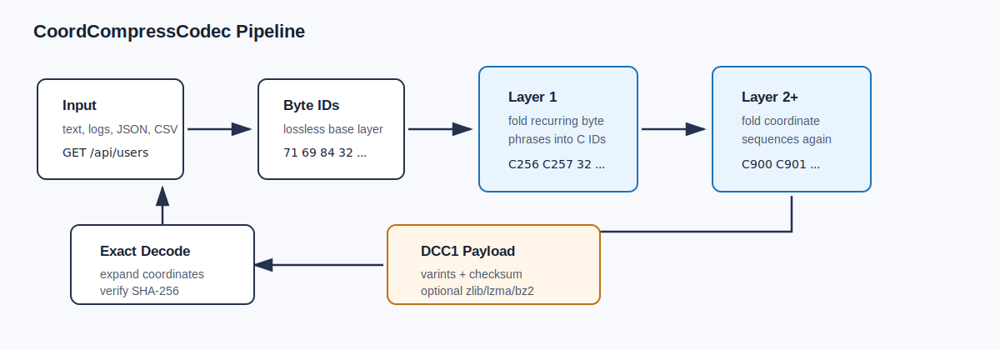
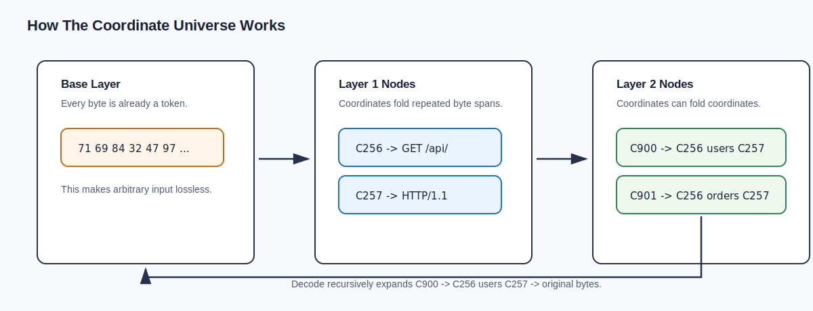
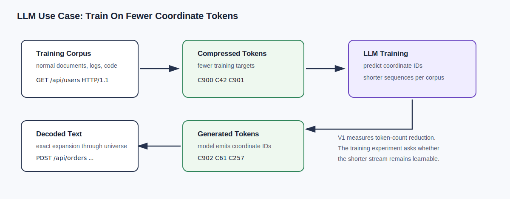

<div align="center">

# CoordCompressCodec

### Lossless recursive coordinate compression for text and structured bytes.

Learn recurring structure. Map it into compact coordinate symbols. Decode back
to the exact original bytes.

<p>
  <a href="LICENSE"></a>
  
  
  
  
</p>

<strong>Compress files and corpora with a shared coordinate universe. Keep
roundtrip recovery exact.</strong>

</div>

---

CoordCompressCodec is a lossless coordinate representation and compression
system for text and structured byte data. It learns recurring structures, maps
them into compact coordinate symbols, and decodes those symbols back to the
exact original bytes.

```text
bytes -> layer 1 coordinates -> layer 2 coordinates -> encoded payload
```

Compression is the first measurable application. The broader purpose is
training-token reduction for language models: encode a corpus into fewer
coordinate tokens, train the model on that shorter coordinate stream, and decode
generated coordinate tokens back to normal text with a deterministic decoder.

The goal of this first release is to provide a clean, auditable implementation
of the coordinate system, with exact decode, a documented file format, and
reproducible benchmarks.

<table>
  <tr>
    <td><strong>0.058</strong><br>payload ratio on Apache logs with a shared universe</td>
    <td><strong>0.101</strong><br>coordinate symbol ratio on Apache logs</td>
    <td><strong>Exact</strong><br>decode back to the original bytes</td>
  </tr>
</table>



## What It Does

The codec learns recurring byte patterns and structural fragments, then replaces
them with coordinate IDs. Each coordinate stores its exact expansion, so
decoding is lossless by construction.

```text
127.0.0.1 - - [10/Oct/2026:13:55:36 +0000] "GET /api/users HTTP/1.1" 200 512
127.0.0.1 - - [10/Oct/2026:13:55:37 +0000] "GET /api/orders HTTP/1.1" 200 768

common log structure -> coordinate symbols
```

Base IDs `0..255` are literal bytes. Coordinate IDs `256+` are learned folds.



## Why Coordinates Matter

Coordinate IDs are not only archive codes. They are reusable symbols with exact
meaning inside a shared universe.

| Use case | What coordinates provide |
|---|---|
| File compression | Fewer symbols and smaller DCC1 payloads for repeated structures |
| Corpus compression | Shared universe amortizes dictionary cost across many files |
| LLM training | Fewer training tokens for the same original corpus |
| LLM inference | Model can emit compact coordinate tokens, then decode to text |
| Evaluation | Exact roundtrip makes quality and corruption easy to measure |

For LLM training, the idea is:

```text
training text corpus
  -> shared coordinate universe
  -> encoded coordinate-token corpus
  -> train model on fewer target tokens
  -> generate coordinate tokens
  -> decode back to normal text
```

This is the central hypothesis: if the coordinate stream is significantly
shorter while remaining learnable, training can spend fewer sequence steps on
the same underlying information. In the benchmark below, the coordinate stream
is `0.460` of the original byte length for `alice.txt` and `0.101` for
`apache_logs`. Those ratios are the first practical signal for possible LLM
training-token reduction.

This V1 repository provides the codec, universe, file format, and metrics needed
to measure that token reduction cleanly before attaching it to a model.



## LLM Training Workflow

The LLM use case is not just storing files smaller. It is changing the training
sequence itself.

1. Build a coordinate universe from the training corpus.
2. Encode each training document into coordinate IDs.
3. Train the model to predict coordinate IDs instead of normal text tokens.
4. At inference time, let the model generate coordinate IDs.
5. Decode those IDs back to readable text with the same universe.

That gives a clean experiment:

```text
baseline tokens per document
vs
coordinate tokens per document
```

If the coordinate corpus is `50%` of the original token count, the model sees a
shorter sequence for the same source data. The open research question is whether
the coordinate stream remains easy enough for the model to learn. This repo
focuses on the codec side of that experiment: exact encoding, exact decoding,
token-count measurement, and reproducible compression benchmarks.

Useful LLM-facing metrics:

| Metric | Meaning |
|---|---|
| coordinate token ratio | coordinate tokens divided by baseline LLM tokens, or by bytes when using byte-level proxy metrics |
| exact roundtrip | decoded training sample equals original sample |
| universe size | number of coordinate IDs added to the model vocabulary |
| bytes per generated token | how much decoded text each generated coordinate token carries |
| learnability | validation loss of a model trained on coordinate tokens |

## System Architecture

The implementation is deliberately small. Each module has one responsibility:

| Module | Responsibility |
|---|---|
| `src/tokenizer.py` | Convert bytes to base IDs and back |
| `src/selector.py` | Find profitable coordinate candidates |
| `src/builder.py` | Build layered coordinate universes |
| `src/universe.py` | Encode/decode coordinate layers and serialize universes |
| `src/codec.py` | Public `DcEncoder` and `DcDecoder` API |
| `src/file_format.py` | DCC1 payload format, checksums, varints, wrappers |
| `src/benchmark.py` | Evaluate compression and roundtrip behavior |

The codec has two shared objects:

```text
CoordinateUniverse
  stores exact coordinate definitions

EncodedPayload
  stores the encoded symbol stream plus checksum metadata
```

As long as encoder and decoder use the same `CoordinateUniverse`, the process is
deterministic and lossless.

## Install

No runtime dependencies are required beyond Python 3.10+.

```bash
python -m unittest discover -s tests
```

## Python API

```python
from src import BuilderConfig, DcDecoder, DcEncoder, UniverseBuilder

text = """\
127.0.0.1 - - [10/Oct/2026:13:55:36 +0000] "GET /api/users HTTP/1.1" 200 512
127.0.0.1 - - [10/Oct/2026:13:55:37 +0000] "GET /api/orders HTTP/1.1" 200 768
127.0.0.1 - - [10/Oct/2026:13:55:38 +0000] "POST /api/orders HTTP/1.1" 201 128
127.0.0.1 - - [10/Oct/2026:13:55:39 +0000] "GET /api/users HTTP/1.1" 200 512
"""

config = BuilderConfig(max_layers=2, max_nodes_per_layer=256, max_ngram=16)
universe, report = UniverseBuilder(config).fit_text(text)

encoder = DcEncoder(universe)
payload = encoder.encode(text)

print(payload.preview())
# C267 B55 B46 B48 B46 B48 B46 C270 B45 B32 B45 B32 C257 ...

print(round(payload.symbol_ratio, 3))
# 0.186

decoder = DcDecoder(universe)
restored = decoder.decode(payload)

assert restored == text
```

## CLI Usage

Build a coordinate universe:

```bash
python build_universe.py \
  --input sample.txt \
  --out artifacts/universe.json
```

Encode a file:

```bash
python encode.py \
  --input sample.txt \
  --universe artifacts/universe.json \
  --out artifacts/sample.dcc
```

Decode a file:

```bash
python decode.py \
  --input artifacts/sample.dcc \
  --universe artifacts/universe.json \
  --out artifacts/restored.txt
```

Benchmark:

```bash
python benchmark.py \
  --input sample.txt data.json logs.txt \
  --save-universe artifacts/universe.json
```

## Benchmark Snapshot

This benchmark uses the sample files in this workspace and a shared coordinate
universe:

```bash
python benchmark.py \
  --input ../sample_data/alice.txt ../sample_data/apache_logs ../sample_data/posts.json ../sample_data/iris.csv ../sample_data/flights.csv \
  --save-universe artifacts/sample_universe.json \
  --max-layers 2 \
  --max-nodes-per-layer 12000 \
  --max-ngram 12 \
  --min-count 3 \
  --active-min-count 2
```

| file | before bytes | after symbols | symbol ratio | payload bytes | payload ratio | best std ratio | roundtrip |
|---|---:|---:|---:|---:|---:|---:|---|
| alice.txt | 174,314 | 80,263 | 0.460 | 56,012 | 0.321 | 0.281 | yes |
| apache_logs | 2,368,364 | 239,931 | 0.101 | 138,157 | 0.058 | 0.055 | yes |
| posts.json | 27,520 | 11,678 | 0.424 | 6,681 | 0.243 | 0.184 | yes |
| iris.csv | 3,858 | 1,853 | 0.480 | 1,028 | 0.266 | 0.172 | yes |
| flights.csv | 2,350 | 1,584 | 0.674 | 1,028 | 0.437 | 0.263 | yes |

`best std ratio` is the best result among zlib, lzma, and bz2 on the original
bytes. `payload ratio` is the DCC1 payload size using the shared universe.

## Repository Structure

```text
src/
  codec.py        public encoder/decoder API
  universe.py     coordinate nodes, layered encode/decode, serialization
  builder.py      recursive universe construction
  selector.py     candidate scoring and selection
  tokenizer.py    byte-preserving tokenizer
  file_format.py  DCC1 payload format
  metrics.py      benchmark table helpers
  benchmark.py    benchmark library helpers

build_universe.py
encode.py
decode.py
benchmark.py

docs/
tests/
examples/
```

## Honest Scope

This is V1. It is a clean prototype of the coordinate compression method. It is
not claiming to beat mature compressors on every byte-level archive benchmark.
The main measurements are:

- exact roundtrip
- coordinate symbol ratio
- DCC1 payload ratio with a shared universe
- comparison against zlib, lzma, and bz2

For small files, storing the universe can dominate size. The intended V1 use
case is shared-universe compression, corpus compression, and LLM
training-token reduction experiments.

## License

CoordCompressCodec is released under the
[CoordCompressCodec Non-Commercial License](LICENSE).

Non-commercial use is permitted. Commercial use requires prior written
permission from Moustapha Oumar.
